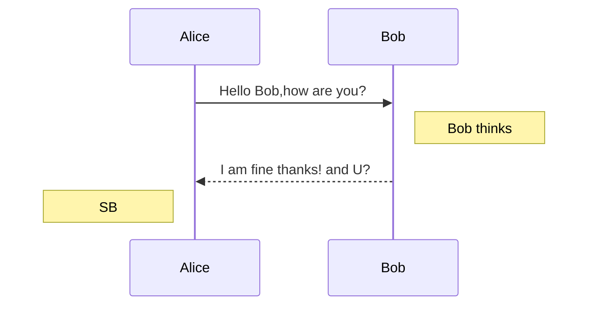
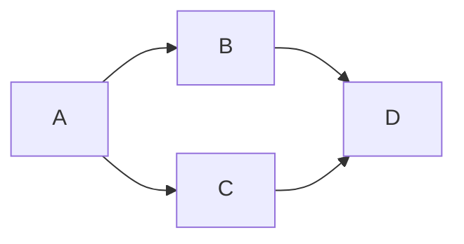

只有少数编辑器支持，或者需要安装相应的扩展渲染，使用前请先预览确认。
<!--more-->

# 定义列表

```
Term 1
Term 2
:   Definition A
:   Definition B
```

会被编译成

```
<dl>
<dd>Term 1</dd>
<dd>Term 2</dd>
<dt>Definition A<dt>
<dt>Definition A<dt>
</dl>
```

# 目录

通过`[TOC]`标记来插入目录。

在编辑器不支持`[TOC]`标记的情况下可以使用添加id的方法构建目录。

```
## Directory
* [1.Content one](#chapter1)
* [2.Content two](#chapter2)

## <span id="chapter1">1.Content one</span>
## <span id="chapter2">2.Content two</span>
```


# TeX公式

内联的TeX公式使用一个美元符号标记。

```
$\Gamma(n) = (n-1)!\quad\forall n\in\mathbb N$
```

会被编译成
内联（行内）公式：$\Gamma(n) = (n-1)!\quad\forall n\in\mathbb N$

TeX公式块用独占一行的两个美元符号来标记。

```
$$\left \lbrace \sum_{i=0}^n i^3 = \frac{(n^2+n)(n+6)}{9} \right \rbrace$$
```

会被编译成

$$\left \lbrace \sum_{i=0}^n i^3 = \frac{(n^2+n)(n+6)}{9} \right \rbrace$$

如果你的编辑器不支持这个功能，可以手动解决。首先引入mathjax脚本：

```
<script type="text/javascript" src="https://cdn.mathjax.org/mathjax/latest/MathJax.js?config=TeX-AMS_HTML"></script>
```

之后，在需要插入公式的地方使用 `<script>` 标签包裹公式：

```
<script type="math/tex">\Gamma(n) = (n-1)!\quad\forall n\in\mathbb N</script>

<script type="math/tex; mode=display">
\Gamma(z) = \int_0^\infty t^{z-1}e^{-t}dt\,.
</script>
```

以上公式展示效果，在实际显示过程中，根据网络加载速度不同会有不同的解析展示速度，TeX的语法参考请见[这里](http://meta.math.stackexchange.com/questions/5020/mathjax-basic-tutorial-and-quick-reference)。

# UML图
语法为在代码块开始行后面加入语法声明，如 \`\`\`mermaid ，然后可以像这样来画uml时序图：



其MarkDown代码如下：
```
\`\`\`mermaid
sequenceDiagram
  Alice->>Bob: Hello Bob,how are you?
  Note right of Bob: Bob thinks
  Bob-->>Alice: I am fine thanks! and U?
  Note left of Alice: SB
\`\`\` #代码块标识会被解析，实际上写代码块时不用添加转义符“\”
```

时序图的语法请见 [这里](https://mermaidjs.github.io/sequenceDiagram.html) 或 [这里](http://bramp.github.io/js-sequence-diagrams/)。


uml流程图：



其实现代码如下：
```
\`\`\`mermaid
graph LR;
  A-->B & C-->D;
\`\`\`
```

流程图的语法请见 [这里](https://mermaidjs.github.io/flowchart.html)， 更复杂点的flowchart可以看 [这里](http://adrai.github.io/flowchart.js/) 。

# 参考文档
1. [MarkDown文档中如何画出流程图](/how-to-draw-flowchart-with-markdown.html)
2. https://github.com/wizardforcel/markdown-simple-world
3. http://stevenshi.me/2017/06/26/hexo-insert-formula/
4. https://blog.csdn.net/u013282174/article/details/80666123
5. https://www.liuyude.com/How_to_make_your_HEXO_blog_support_handwriting_flowchart.html
6. https://mermaidjs.github.io/


<script type="text/javascript" async
  src="https://unpkg.com/mermaid@9.1.1/dist/mermaid.min.js">
</script>
