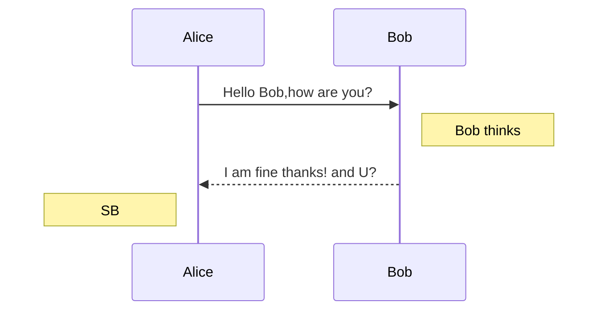
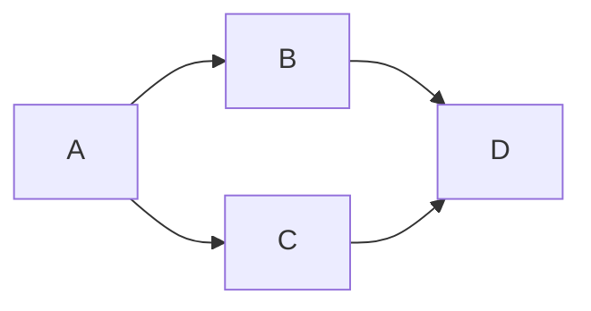

有少数编辑器不支持，或者需要安装相应的扩展渲染，使用前请先预览确认。
<!--more-->

## 目录

通过`[TOC]`标记来插入目录。

在编辑器不支持`[TOC]`标记的情况下可以使用添加id的方法构建目录。

```MarkDown
* [1.Content one](#chapter1)
* [2.Content two](#chapter2)
```

显示效果：
  * [1.Content one](#chapter1)
  * [2.Content two](#chapter2)


## TeX公式

内联的TeX公式使用一个美元符号标记。

```MarkDown
$\Gamma(n) = (n-1)!\quad\forall n\in\mathbb N$
```

会被编译成
内联（行内）公式：$\Gamma(n) = (n-1)!\quad\forall n\in\mathbb N$

TeX公式块用独占一行的两个美元符号来标记。

```MarkDown
$$\left \lbrace \sum_{i=0}^n i^3 = \frac{(n^2+n)(n+6)}{9} \right \rbrace$$
```

会被编译成

$$\left \lbrace \sum_{i=0}^n i^3 = \frac{(n^2+n)(n+6)}{9} \right \rbrace$$

一段解题演示:
  1. $\because f(x)$的定义域为$(0,+\infty)$，$f{^{\prime}}(x)=\dfrac{1-a-ln x}{x^2}$，$ \therefore f{^{\prime}}(\mathrm{e})=-\dfrac{a}{e^2}$，由已知可得$f{^{\prime}}(\mathrm{e})\times 2=-1$，即$a=\dfrac{\mathrm{e}^2}{2}$
        
  2. 当 $x>0$ 时$g(x)\geq f(x)$，即：$$\mathrm{e}^x+\dfrac{2}{x}-1\geq\dfrac{\ln x+a}{x}$$ 化简可得：$a\le x\left(\mathrm{e}^x-1\right)-\ln x+2$

以上公式渲染，一般编辑器或渲染模板都会支持，如果你的环境恰好不支持这个功能，可以手动解决。首先引入mathjax脚本：

```HTML
<script type="text/javascript" src="https://cdn.mathjax.org/mathjax/latest/MathJax.js?config=TeX-AMS_HTML"></script>
```

之后，在需要插入公式的地方使用 `<script>` 标签包裹公式：

```MarkDown
<script type="math/tex">\Gamma(n) = (n-1)!\quad\forall n\in\mathbb N</script>

<script type="math/tex; mode=display">
\Gamma(z) = \int_0^\infty t^{z-1}e^{-t}dt\,.
</script>
```

以上公式展示效果，在实际显示过程中，根据网络加载速度不同会有不同的解析展示速度，`TeX`/`LaTex` 公式语法参考请见[这里](http://meta.math.stackexchange.com/questions/5020/mathjax-basic-tutorial-and-quick-reference)。

## UML图
语法为在代码块开始行后面加入语法声明，如 \`\`\`mermaid ，然后可以像这样来画uml时序图：



其MarkDown代码如下：
```MarkDown
\`\`\`mermaid
sequenceDiagram
  Alice->>Bob: Hello Bob,how are you?
  Note right of Bob: Bob thinks
  Bob-->>Alice: I am fine thanks! and U?
  Note left of Alice: SB
\`\`\` #代码块标识会被解析，实际上写代码块时不用添加转义符“\”
```

时序图的语法请见 [这里](https://mermaidjs.github.io/sequenceDiagram.html) 或 [这里](http://bramp.github.io/js-sequence-diagrams/)。


uml流程图：



其实现代码如下：
```MarkDown
\`\`\`mermaid
graph LR;
  A-->B & C-->D;
\`\`\`
```

流程图的语法请见 [这里](https://mermaidjs.github.io/flowchart.html)， 更复杂点的flowchart可以看 [这里](http://adrai.github.io/flowchart.js/) 。

## 参考文档
1. [Markdown 入门参考](http://xianbai.me/learn-md/article/about/readme.html)
2. [MarkDown文档中如何画出流程图](https://sobaigu.com/how-to-draw-flowchart-with-markdown.html)
3. https://github.com/wizardforcel/markdown-simple-world
4. http://stevenshi.me/2017/06/26/hexo-insert-formula/
5. https://blog.csdn.net/u013282174/article/details/80666123
6. https://www.liuyude.com/How_to_make_your_HEXO_blog_support_handwriting_flowchart.html
7. https://mermaidjs.github.io/


<script type="text/javascript" async
  src="https://cdn.staticfile.org/mermaid/10.6.1/mermaid.min.js">
</script>
