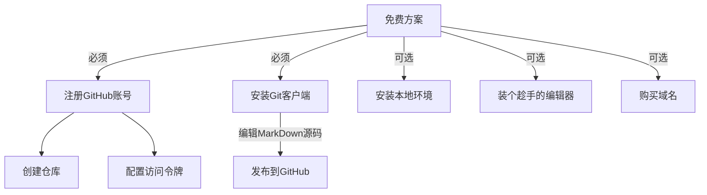
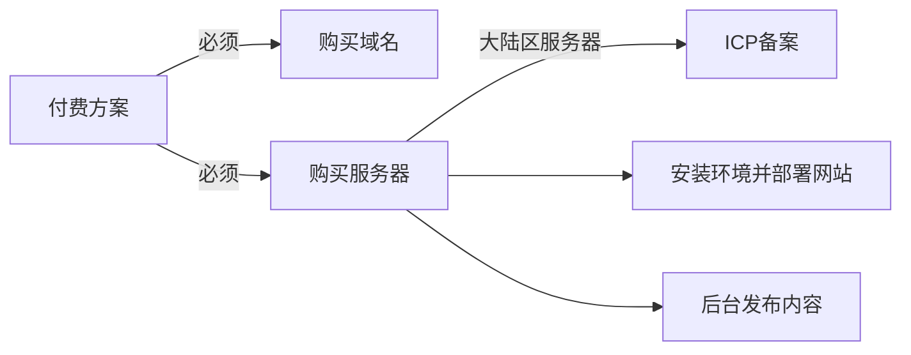

既然这是篇小白零基础建站教程，那么就不会涉及带门槛的方案，只是简单罗列了适合新手的案例，其他同等方案或者更复杂方案等熟悉了可以再自行研究。

## 方案对比
1. 免费：**hugo/hexo + GitHub + GitHub免费二级域名/自备域名**
   ```mermaid
    flowchart LR;
      本地维护MarkDown内容 -- hugo/hexo渲染 -->本地效果预览
      GitHub私有仓库 -- 绑定自备域名 --> 公开pages服务
      本地维护MarkDown内容 <-- git同步 --> GitHub私有仓库 -- 触发action自动渲染 --> 公开pages服务
   ```
   - 优点：有免费资源，静态页速度快，网站源文件通过git版本管理安全可靠
   - 缺点：需要点MarkDown语法知识，缺界面化管理后台
2. 付费：**WordPress/Typecho/Zblog + 自备服务器 + 自备域名**
   ```mermaid
    flowchart LR;
      自备域名 -- DNS解析 --> 自备服务器 --> 网站对外服务
      网站界面后台维护内容 --> 自备服务器 -- 大陆区服务器 --> ICP备案 --> 网站对外服务
   ```
   - 优点：功能强大几乎能满足所有需求，装好后带后台，纯界面操作
   - 缺点：需要自己购买服务器和域名，度对服务器要求高，响应速度相对慢点

## 准备条件

- **免费方案**：
  1. **GitHub账号**：要使用免费的资源，不得注册个账号绑定才能找得到么？虽然国内Gitee也有，但绑定自己的域名要收费，而且内容要审核，所以还是直接用GitHub吧。当然，你有自己服务器和域名也可以用来替代。
  2. **Git客户端**：用来同步管理源代码，改了什么一目了然
  3. **MarkDown 编辑器**：纯手工敲代码是不可能的，借助编辑器事半功倍，而且还能和Git结合，大大降低难度
  4. **域名「可选」**：花点小钱占个自己的域名赏心悦目，也好打响自己的品牌，万一哪天走了张[伟波](/ "微博在2010年耗资800万收购 weibo.com")的运呢？


- **付费方案**：
  1. **域名**：虽然也有免费的，但还是建议花钱买，每年几十元
  2. **服务器/云主机/虚拟主机**：需要带数据库，支持PHP及安装扩展
  3. **ICP备案**：如果用大陆区服务器，必须先工信部ICP备案后才可用，大约需耗时6周

<script type="text/javascript" async
  src="https://cdn.staticfile.org/mermaid/9.1.1/mermaid.min.js">
</script>
